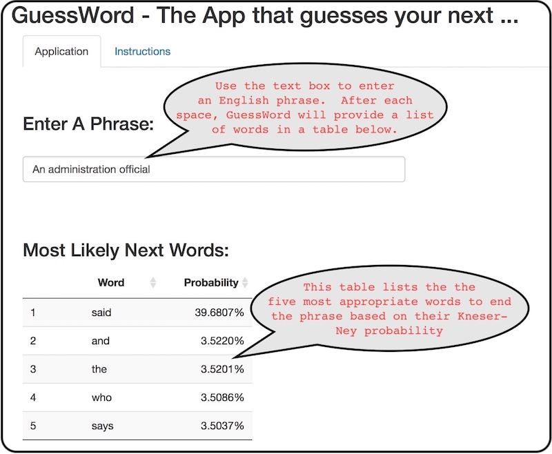

<style type="text/css">
h2 {
  margin-bottom: -40px;
};

</style>

```{r setup, include=FALSE}
library(tidyverse)
library(knitr)
library(kableExtra)
library(caret)
opts_chunk$set(echo = FALSE)
opts_knit$set(root.dir = "~/coursera/DataScience-CS")
```

## Overview {.smaller}
- GuessWord is a Shiny application that attempts to guess the next word in a given English phrase.

- The prediction algorithm is based on a trigram language model with Kneser-Ney smoothing

- The data used to create the language model was provided by SwiftKey in the form of excerpts from News, Blog and Twitter postings.

- Just over 2.5 million excerpts of English text were processed to construct the model

```{r ugramdata, cache=TRUE, message=FALSE, echo=FALSE}
## Load Data
twtrtext <- read_lines("data/en_US/en_US.twitter.txt")
blogtext <- read_lines("data/en_US/en_US.blogs.txt")
newstext <- read_lines("data/en_US/en_US.news.txt")
twtrn <- length(twtrtext); blogn <- length(blogtext); newsn <- length(newstext)

## Create Corpus
corpus <- rbind(
  data_frame(source = as.factor(rep("News", newsn)), excerpt = 1:newsn, 
             text = newstext),
  data_frame(source = as.factor(rep("Blogs", blogn)), excerpt = 1:blogn, 
             text = blogtext),
  data_frame(source = as.factor(rep("Twitter", twtrn)), excerpt = 1:twtrn, 
             text = twtrtext))

ugrams <- readRDS("data/ugrams.rds")
ugramstats <- summarise(ugrams, n_toks = sum(n), n_grams = n())

bgrams <- readRDS("data/bgrams.rds")
bgramstats <- summarise(bgrams, n_toks = sum(n), n_grams = n())

tgrams <- readRDS("data/tgrams.rds")
tgramstats <- summarise(tgrams, n_toks = sum(n), n_grams = n())

set.seed(1234)
inTrain <- createDataPartition(corpus$source, p=0.60, list=FALSE)

corpastats <- list(summarise(group_by(corpus[inTrain,], source), ln = n()),
                   ugramstats, bgramstats, tgramstats) %>%
  Reduce(function(dtf1, dtf2) full_join(dtf1, dtf2, by = "source"), .)
```

```{r stattable, message=FALSE, echo=FALSE}
kable(corpastats, format = "html", ##booktabs = "T", 
      format.args = list(big.mark = ","),
      col.names = c("Source", "Excerpts", rep(c("Tokens", "N-Grams"), 3)))  %>%
  kable_styling(bootstrap_options = c("striped", "bordered"), full_width = F) %>%
  add_header_above(c(" ", " ", "Unigrams" = 2, "Bigrams" = 2, "Trigrams" = 2)) %>%
  column_spec(2:8, width = "0.9in")
```
<BR>

- Prediction speed and accuracy is good, however initial application launch is slow due to loading of probability tables

## Corpus Processing {.smaller}
- Each of the excerpts was cleaned and normalized prior to *n*-gram extraction
    - Normalization from UTF-8 format into all lowercase ASCII
    - Numbers, URLs, Hashtags and Re-tweets were deleted
    - Hyphens and underscores were converted to spaces
    - Contractions were expanded into their fully worded counterparts where possible
    - Many abbreviations were converted into their fully worded counterparts
    - Letters repeated 3 or more times were replaced by one instance of the letter
<BR><BR>
- Unigrams, bigrams and trigrams were generated using the *tidytext* package
- The *n*-grams were filtered using a dictionary from [Josh Kaufman](https://github.com/first20hours/google-10000-english) consisting of ~10,000 "words"
- *n*-grams that had a token not in the dictionary were discarded.
- This reduced the size of the probability tables and removed profanity

## Prediction Algorithm {.smaller}
- In order to account for words that we do not have in the corpus, [Kneser-Ney Smoothing](https://west.uni-koblenz.de/sites/default/files/BachelorArbeit_MartinKoerner.pdf) was employed.

- The discount factor $D_n = \frac{n_1}{n_1+2n_2}$ is calculated such that $n_x$ is the count of $n$-grams occurring $x$ times.

<font size="3"><div class="centered">$P_{KN}(w_3|w_1,w_2) = \frac{max(C(w_1,w_2,w_3) - D_3,0)}{C(w_1,w_2)} + D_3* \frac{N(w_1,w_2,\bullet)}{C(w_1,w_2)} * (\frac{max(N(\bullet,w_2,w_3) - D_2,0)}{N(\bullet,w_2,\bullet)} + D_2 * \frac{N(w_2,\bullet)}{N(\bullet,w_2,\bullet)} * \frac{N(\bullet,w_3)}{N(\bullet,\bullet)})$</div></font>

- Frequency tables store the 5 highest KN probability entries for trigrams and bigrams and all unigram entries.

- The GuessWord algorithm combines Kneser-Ney and Backoff to find 5 guesses 
```{r algo, message=FALSE, echo=TRUE, eval=FALSE}
      1. Clean entered phrase using same procedure as corpus
      2. Return guesses from KN trigram using w1w2 
      3. If not enough guesses, append guesses from KN bigram using w2
      4. If not enough guesses, append guesses from KN unigram using w2
      5. If not enough guesses, append guesses using unigram Maximum Likelihood
```
- Future Improvements for Accuracy
    - <font size="4">Increase the size of the dictionary and apply a spell check to the corpus</font>
    - <font size="4">Use high-order *n*-grams in the model and incorporate start-of-sentence tokens</font>
    - <font size="4">Allow the user to select context of phrase (News, Web, or Twitter)</font>

## GuessWord Application {.smaller}
<div class="centered">
 
</div>


- Links
    - <font size="4">GuessWord application on shinyapps.io: [GuessWord](https://cstietzel.shinyapps.io/guessword/)</font>
    - <font size="4">Code and Rmd's on Github: [https://github.com/cstietzel/ds10-capstone](https://github.com/cstietzel/ds10-capstone)</font>
    
    
